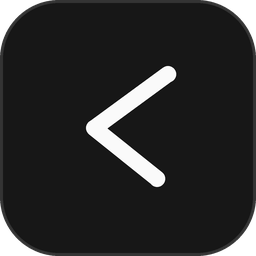

  

<h1 align="center">Aven</h1>

  A desktop workspace for your coding agents.

Aven brings agent conversations, your project, and a browser into one window. Use your own provider accounts and subscriptions, organize work into local workspace profiles, and keep the tools you need beside the conversation.

## Download

Get the build for Apple Silicon Macs running macOS 13 or later from [Aven Releases](https://github.com/capi-git/aven/releases). Download the macOS ZIP, extract it, and move **Aven.app** to Applications.

The app is ad-hoc signed, not Apple-notarized, so macOS may require you to approve opening it in **System Settings → Privacy & Security**. Only approve a copy you downloaded from this repository's releases. Intel Mac, Windows, and Linux release builds are not currently provided or verified.

Aven 0.1.80 and later checks for updates from this repository and downloads signed updates in the background. Choose **Restart to update** when your work is ready; Aven does not interrupt running agents. Older versions need one manual replacement to enable this updater.

Model lists refresh automatically from your installed providers. New models appear as the provider makes them available to your account, without an Aven release. Native Codex and Claude installations can also keep themselves current through their official updaters; control this in **Settings → Providers → Keep provider tools up to date**. Package-manager installations stay managed by their package manager.

## Get started

1. Install and sign in to a supported agent CLI, such as [Claude Code](https://claude.com/product/claude-code) or [Codex](https://developers.openai.com/codex/cli).
2. Open Aven and choose a project folder.
3. Select an available provider and model, choose an access mode, and start a task.

Aven does not include model access or sell tokens. Provider subscriptions, API charges, authentication, and usage limits remain with the provider. Adapters are included for Claude Code, Codex, Cursor, Grok Build, OpenCode, Pi, omp, and fx; available features depend on the installed CLI and its version.

## What you can do

- **Keep work together:** conversations, split panes, an embedded browser, a file editor, Git changes, and terminals.
- **Comment on a page:** click Edit page, select an element, and add a comment beside it. **Add to chat** puts your comment and an element screenshot in the draft for review before sending. **Change element** picks another target; Escape or Done exits.
- **Organize projects:** switch between local workspace profiles, arrange tabs and folders, and choose each workspace's appearance.
- **Guide agents:** review approvals, queue follow-ups, inspect changes, and coordinate a lead with workers through [orchestration](docs/ORCHESTRATION.md).
- **Save context:** use Notes for Markdown notes and Inbox for GitHub issues, pull requests, and Linear tasks from connected projects.
- **Make it yours:** dark and light themes, workspace colors, translucent surfaces, and optional chat backgrounds.

For GitHub Inbox, set an explicit account for each project using the [GitHub account setup guide](docs/GITHUB-ACCOUNTS.md).

Workspace profiles organize the interface and projects. They do **not** isolate external provider credentials or sign you into separate Claude, Codex, GitHub, or Linear accounts.

Agents can edit files and run commands according to the access mode you select. Review that mode before starting a task, and use version control for projects you let agents change.

## Build and contribute

Aven uses React, TypeScript, Rust, and Tauri. The macOS release also embeds Chromium. See the [Chromium build guide](docs/CHROMIUM.md) for prerequisites and build commands, and [release instructions](docs/RELEASING.md) for packaging.

Bug reports and focused pull requests are welcome. Read [CONTRIBUTING.md](CONTRIBUTING.md) before making a larger change. Report vulnerabilities using the private process in [SECURITY.md](SECURITY.md).

## License and origins

Aven is licensed under [MIT](LICENSE). It began from the MIT-licensed [MonoCode](https://github.com/hardbeat920/monocode) project by Nick and contributors and is maintained independently by Jack Hagan. Original copyright notices are preserved. Aven releases and updates come from this repository. See [NOTICE](NOTICE) for attribution and provider trademarks.
