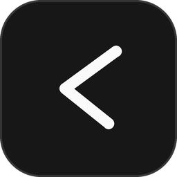

  

<h1 align="center">Aven</h1>

  A desktop workspace for your coding agents.

Aven brings agent conversations, your project, and a browser into one window. Use your own provider accounts and subscriptions, organize work into local workspace profiles, and keep the tools you need beside the conversation.

## Download

**macOS:** Download the [Mac app](https://github.com/capi-git/aven/releases/latest/download/Aven-macos-arm64.zip) for Apple Silicon Macs running macOS 13 or later, extract it, and move **Aven.app** to Applications. Or download it from the website, [aven-desktop.vercel.app](https://aven-desktop.vercel.app).

From 0.1.121 the Mac app is Developer ID signed and notarized by Apple, so it opens normally after download. Each release's notes confirm its notarization. Earlier builds may ask you to approve opening the app in **System Settings → Privacy & Security**. Intel Mac and Linux release builds are not currently provided or verified.

**Windows:** Download the [Windows x64 installer](https://github.com/capi-git/aven/releases/latest/download/Aven-windows-x64-setup.exe) from the same [latest release](https://github.com/capi-git/aven/releases/latest), or extract `Aven-<version>-windows-x64.zip` and run the installer inside. The installer is not Authenticode-signed, so Windows may show an unknown-publisher warning when you first install it. After that, Aven for Windows downloads signed updates in the background and installs them when you choose **Restart to update**; versions from before Windows updates need one manual update. Windows uses WebView2, and some browser and desktop-control features remain macOS-only. See [Aven for Windows](docs/WINDOWS.md) for setup, checksums, and platform limitations.

On macOS, Aven 0.1.80 and later checks for updates from this repository and downloads signed updates in the background. Choose **Restart to update** when your work is ready; Aven does not interrupt running agents. Older versions need one manual replacement to enable this updater.

Model lists refresh automatically from your installed providers. New models appear as the provider makes them available to your account, without an Aven release. Native Codex and Claude installations can also keep themselves current through their official updaters; control this in **Settings → Providers → Keep provider tools up to date**. Package-manager installations stay managed by their package manager.

## Get started

1. Open Aven and choose the providers you want to connect in the first-launch setup, or open **Settings → Provider setup** later. Nothing is preselected or automatically installed.
2. For [Claude Code](https://claude.com/product/claude-code) or [Codex](https://developers.openai.com/codex/cli), review and explicitly run the installation or sign-in step. Other providers link to their official guides. You can defer setup and return later.
3. Check the connection, choose a project folder, select a provider and model, choose an access mode, and start a task. See [Connect your providers](docs/PROVIDER-SETUP.md) for the difference between installation, sign-in and a successful response.

Aven does not require an Aven account, include model access or sell tokens. Provider subscriptions, API charges, authentication, and usage limits remain with the provider. Adapters are included for Claude Code, Codex, Cursor, Grok Build, OpenCode, Pi, omp, and fx; available features depend on the installed CLI and its version.

## What you can do

- **Keep work together:** conversations, split panes, an embedded browser, a file editor, Git changes, and terminals.
- **Comment on a page:** click Edit page, select an element, and add a comment beside it. **Add to chat** puts your comment and an element screenshot in the draft for review before sending. **Change element** picks another target; Escape or Done exits.
- **Organize projects:** switch between local workspace profiles, arrange tabs and folders, and choose each workspace's appearance.
- **Guide agents:** review approvals, queue follow-ups, inspect changes, and coordinate a lead with workers through [orchestration](docs/ORCHESTRATION.md).
- **Save context:** use Notes for Markdown notes and Inbox for GitHub issues, pull requests, and Linear tasks from connected projects.
- **Make it yours:** dark and light themes, workspace colors, translucent surfaces, and optional chat backgrounds.

For GitHub Inbox, set an explicit account for each project using the [GitHub account setup guide](docs/GITHUB-ACCOUNTS.md).

Workspace profiles organize the interface and projects. They do **not** isolate external provider credentials or sign you into separate Claude, Codex, GitHub, or Linear accounts.

Agents can edit files and run commands according to the access mode you select. Review that mode before starting a task, and use version control for projects you let agents change.

## Build and contribute

Aven uses React, TypeScript, Rust, and Tauri. The macOS release also embeds Chromium. See the [Chromium build guide](docs/CHROMIUM.md) for prerequisites and build commands, and [release instructions](docs/RELEASING.md) for packaging. Windows builds use WebView2; see the [Windows build guide](docs/WINDOWS.md).

To work on Aven inside Aven, open this repository and run `npm run dev:app` in its terminal. The complete **Aven Dev** preview uses separate chats, settings and browser data while your installed app stays open. See [Develop Aven inside Aven](docs/DEVELOPMENT.md) for setup and checks. **Settings → Skills & Tools** lists reusable skills and reports readiness for built-in browser tools and optional desktop computer use.

Bug reports and focused pull requests are welcome. Read [CONTRIBUTING.md](CONTRIBUTING.md) before making a larger change. Report vulnerabilities using the private process in [SECURITY.md](SECURITY.md).

## License and origins

Aven is licensed under [MIT](LICENSE). It began from the MIT-licensed [MonoCode](https://github.com/hardbeat920/monocode) project by Nick and contributors and is maintained independently by Jack Hagan. Original copyright notices are preserved. Aven releases and updates come from this repository. See [NOTICE](NOTICE) for attribution and provider trademarks.

Current product labels, native executables, helper applications, and frontend package metadata use **Aven**. Some internal identifiers retain older names for compatibility; see [Branding and compatibility](docs/BRANDING.md) before renaming them.
