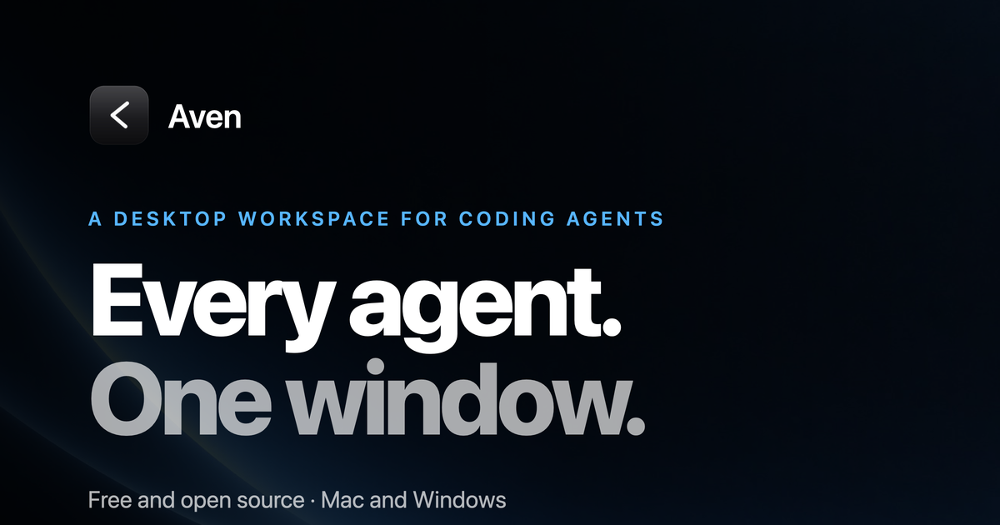

  

  
  

  
  

Aven brings agent conversations, your project and a browser into one window. Use your own provider accounts and subscriptions, organize work into local workspace profiles, and keep the tools you need beside the conversation.

## What you can do

- **Keep work together:** conversations, split panes, an embedded browser, a file editor, Git changes and terminals.
- **Comment on a page:** click Edit page, select an element and add a comment beside it. **Add to chat** puts your comment and an element screenshot in the draft for review before sending.
- **Run agents on a schedule:** Automations start agents at set times while your computer is awake and Aven is open, with ready-made examples to start from.
- **Guide agents:** review approvals, queue follow-ups, inspect changes, and coordinate a lead with workers through [orchestration](docs/ORCHESTRATION.md).
- **Save context:** Notes for Markdown notes, and Inbox for GitHub issues, pull requests and Linear tasks from connected projects.
- **Make it yours:** dark and light themes, workspace colors, translucent surfaces and optional chat backgrounds.

## Install

**Mac:** download the app for Apple Silicon Macs on macOS 13 or later, extract it and move **Aven.app** to Applications. It is signed and notarized by Apple, so it opens normally.

**Windows:** download and run the x64 installer. It is not yet Authenticode-signed, so Windows may show an unknown-publisher warning on first install. See [Aven for Windows](docs/WINDOWS.md) for checksums and the features that are still macOS-only.

Both versions download signed updates in the background and install them when you choose **Restart to update**. Aven never interrupts running agents. Intel Mac and Linux builds are not currently provided.

## Get started

1. Open Aven and choose the providers you want to connect in the first-launch setup, or later in **Settings → Provider setup**. Nothing is preselected or installed automatically.
2. For [Claude Code](https://claude.com/product/claude-code) or [Codex](https://developers.openai.com/codex/cli), review and run the install or sign-in step. Other providers link to their official guides.
3. Choose a project folder, a provider and model, and an access mode, then start a task. See [Connect your providers](docs/PROVIDER-SETUP.md) for details.

Aven needs no Aven account and does not sell model access. Subscriptions, API charges, sign-in and usage limits stay with each provider. Adapters are included for Claude Code, Codex, Cursor, Grok Build, OpenCode, Pi, omp and fx. Model lists refresh from your installed providers without an Aven release.

> [!NOTE]
> Agents can edit files and run commands according to the access mode you choose. Review it before starting a task, and use version control for projects you let agents change. Workspace profiles organize projects; they do not separate provider, GitHub or Linear accounts. For GitHub Inbox, see the [account setup guide](docs/GITHUB-ACCOUNTS.md).

## Build and contribute

Aven uses React, TypeScript, Rust and Tauri. The Mac app embeds Chromium; Windows uses WebView2.

- [Develop Aven inside Aven](docs/DEVELOPMENT.md): run `npm run dev:app` for a separate **Aven Dev** preview while your installed app stays open.
- [Chromium build guide](docs/CHROMIUM.md), [Windows build guide](docs/WINDOWS.md) and [release instructions](docs/RELEASING.md).
- [Contributing](.github/CONTRIBUTING.md) and [security reporting](.github/SECURITY.md).

Bug reports and focused pull requests are welcome.

## License and origins

Aven is licensed under [MIT](LICENSE). It began from the MIT-licensed [MonoCode](https://github.com/hardbeat920/monocode) project by Nick and contributors, and is maintained independently. Original copyright notices are preserved. See [NOTICE](NOTICE) for attribution and provider trademarks, and [Branding and compatibility](docs/BRANDING.md) for internal names that still use older identifiers.
